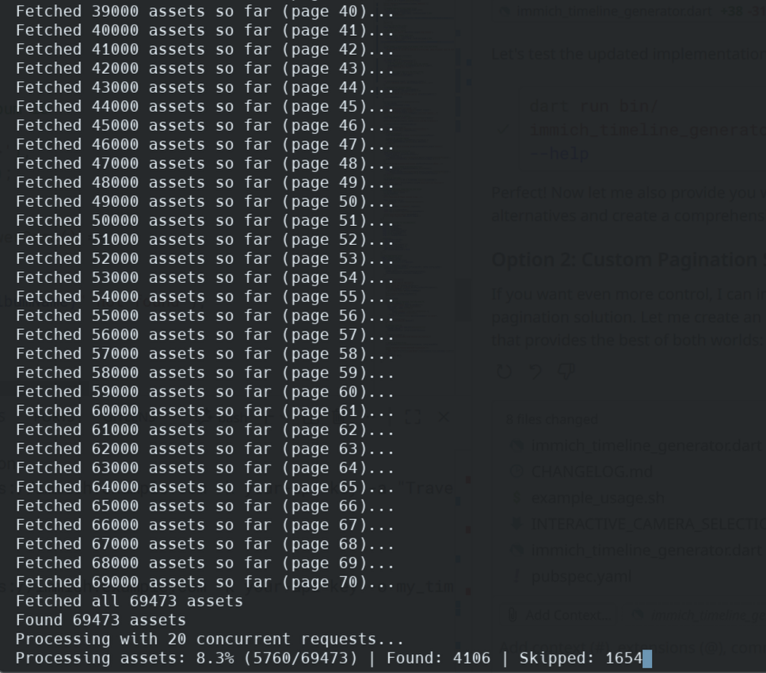

# Immich Timeline Generator

A Dart console application that connects to an Immich instance, extracts GPS coordinates from photos, and generates a timeline in Google's Records.json format that can be imported into Reitti and other self-hosted timeline services.



## Features

- **Immich Integration**: Connects to your Immich server using API key authentication
- **GPS Extraction**: Extracts GPS coordinates from photo EXIF data
- **Google Timeline Format**: Generates Records.json compatible with most timeline services
- **Paginated Camera Selection**: Navigate through cameras using numbered commands and page navigation
- **Multi-User Support**: Filter by specific cameras to separate timelines for different users
- **Album Filtering**: Option to limit processing to specific albums/folders
- **Location Filtering**: Configurable minimum number of photos per location to filter out random GPS coordinates
- **High Performance**: Parallel processing with configurable concurrency for large libraries
- **Progress Tracking**: Shows real-time progress for large photo libraries
- **Error Handling**: Robust error handling with informative messages

## Installation

1. Ensure you have Dart SDK 3.9.0 or later installed
2. Clone or download this repository
3. Install dependencies:
   ```bash
   dart pub get
   ```

## Usage

### Basic Usage

```bash
dart run bin/immich_timeline_generator.dart -u https://your-immich-server.com -k your-api-key
```

### Advanced Usage

```bash
# Filter by specific album and set minimum photos per location
dart run bin/immich_timeline_generator.dart \
  -u https://your-immich-server.com \
  -k your-api-key \
  -a "Travel Photos" \
  -m 5 \
  -o my_timeline.json
```

### Command Line Options

- `-u, --url`: **Required** - Immich server URL (e.g., https://immich.example.com)
- `-k, --api-key`: **Required** - Immich API key
- `-a, --album`: *Optional* - Album name to filter photos (case-insensitive)
- `-m, --min-photos`: *Optional* - Minimum number of photos per location (default: 3)
- `-c, --concurrent`: *Optional* - Number of concurrent API requests (default: 20)
- `-o, --output`: *Optional* - Output file path (default: Records.json)
- `--skip-camera-selection`: *Optional* - Skip interactive camera selection and include all cameras
- `-h, --help`: Show help message

## Camera Selection

For multi-user Immich libraries, the application provides a paginated camera selection interface:

- **Paginated Display**: Shows 8 cameras per page for easy navigation
- **Numbered Commands**: Use numbers (1-8) to toggle camera selection on/off
- **Page Navigation**: Use 'n' for next page, 'p' for previous page
- **All Cameras Option**: Use '0' to toggle selection of all cameras at once
- **Visual Indicators**: Selected cameras are marked with ✓
- **Photo Statistics**: See photo count and percentage for each camera
- **Skip Option**: Use `--skip-camera-selection` to automatically include all cameras

### Camera Selection Interface Example:

```
Camera Selection - Page 1 of 3
============================================================
0. [ ] All cameras (15,234 total photos)
1. [✓] iPhone 14 Pro                     8,500 photos (55.8%)
2. [ ] Samsung Galaxy S23                4,200 photos (27.6%)
3. [✓] Canon EOS R5                      2,534 photos (16.6%)

Commands:
  1-8     : Toggle camera selection
  0       : Toggle all cameras
  n       : Next page
  done    : Finish selection
  help    : Show this help

Selected: 2/12 cameras
Enter command: 
```

## Getting Your Immich API Key

1. Log into your Immich web interface
2. Go to Account Settings (click your profile picture)
3. Navigate to the "API Keys" section
4. Click "New API Key"
5. Give it a name (e.g., "Timeline Generator")
6. Copy the generated API key

## Output Format

The application generates a `Records.json` file in Google Timeline format:

```json
{
  "locations": [
    {
      "latitudeE7": 377749000,
      "longitudeE7": -1224194000,
      "timestamp": "2023-12-25T14:30:00.000Z",
      "accuracy": 10
    }
  ]
}
```

This format is compatible with:
- Reitti (self-hosted timeline service)
- Google Timeline imports
- Other timeline services that support Google's Records.json format

### Field Descriptions

- `latitudeE7`: Latitude × 10^7 (Google's integer format)
- `longitudeE7`: Longitude × 10^7 (Google's integer format)
- `timestamp`: ISO8601 timestamp (e.g., "2023-12-25T14:30:00.000Z")
- `accuracy`: GPS accuracy in meters (default: 10)
- Most other timeline visualization tools

## Configuration Options

### Album Filtering (`--album`)

Use this to limit processing to photos in a specific album:
- Useful for processing only travel photos or specific events
- Album name matching is case-insensitive
- If album is not found, the application will error

### Minimum Photos Per Location (`--min-photos`)

Filters out locations with fewer than the specified number of photos:
- **Default**: 3 photos minimum
- **Purpose**: Eliminates GPS coordinates from wallpapers, screenshots, or accidental photos
- **Recommendation**: 
  - Use 1-2 for comprehensive tracking
  - Use 3-5 for significant locations only
  - Use 5+ for major destinations only

## Examples

### Basic Timeline Generation
```bash
# Generate timeline with interactive camera selection
dart run bin/immich_timeline_generator.dart \
  -u https://immich.mydomain.com \
  -k abc123...
```

### Multi-User Timeline (Camera Selection)
```bash
# Use paginated camera selection for multi-user libraries
dart run bin/immich_timeline_generator.dart \
  -u https://immich.mydomain.com \
  -k abc123... \
  -o family_timeline.json
# Follow the numbered commands to select specific cameras/phones
```

### Automated Processing (Skip Camera Selection)
```bash
# Skip camera selection and include all cameras
dart run bin/immich_timeline_generator.dart \
  -u https://immich.mydomain.com \
  -k abc123... \
  --skip-camera-selection \
  -o complete_timeline.json
```

### Travel Timeline
```bash
# Generate timeline from travel album with strict filtering
dart run bin/immich_timeline_generator.dart \
  -u https://immich.mydomain.com \
  -k abc123... \
  -a "Vacation 2024" \
  -m 5 \
  -o vacation_2024_timeline.json
```

### High-Performance Processing
```bash
# Process large libraries with increased concurrency
dart run bin/immich_timeline_generator.dart \
  -u https://immich.mydomain.com \
  -k abc123... \
  -c 50 \
  --skip-camera-selection \
  -m 2
```

## Performance

- **Large Libraries**: The application shows progress and handles large photo collections efficiently
- **Rate Limiting**: Built-in delays prevent overwhelming your Immich server
- **Memory Usage**: Processes photos in batches to manage memory consumption
- **Network**: Only downloads metadata, not the actual photos

## Troubleshooting

### Common Issues

1. **"Failed to fetch assets"**: Check your API key and server URL
2. **"Album not found"**: Verify the album name (case-insensitive matching)
3. **No location data**: Ensure your photos have GPS EXIF data
4. **Empty output**: Check if minimum photos per location is too high

### API Compatibility

This application is compatible with:
- Immich v1.90.0 and later
- API versions that support the `/api/search/metadata` endpoint

## Development

### Running Tests
```bash
dart test
```

### Building
```bash
dart compile exe bin/immich_timeline_generator.dart -o immich_timeline_generator
```

## Contributing

1. Fork the repository
2. Create a feature branch
3. Add tests for new functionality
4. Submit a pull request

## License

This project is open source. See LICENSE file for details.

## Related Projects

- [Immich](https://immich.app/) - Self-hosted photo and video backup solution
- [Reitti](https://github.com/isokissa3/Reitti) - Self-hosted timeline service
- [Google Takeout](https://takeout.google.com/) - For Google Timeline exports
